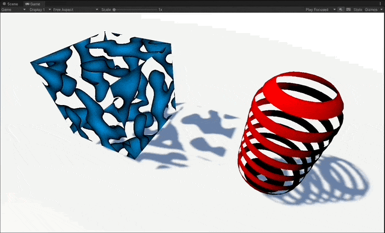
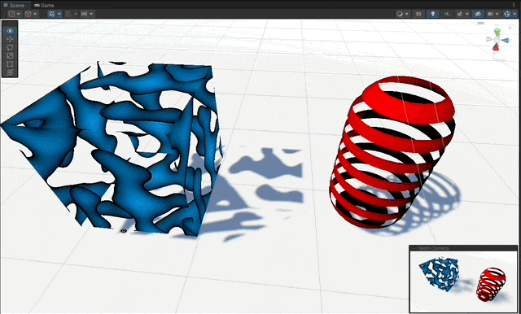
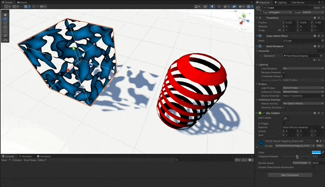
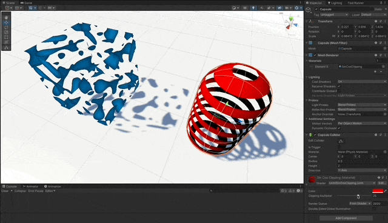

# Clipping pixels in a Shader

With the Cg programming language for the Built-in RP for **Unity 2021.3.10f1**

### References

- [Unity Shaders course by Nik Lever](https://www.udemy.com/course/learn-unity-shaders-from-scratch)

## Features

1. Clipping using Perlin Noise.
1. Clipping using cosine function of the Object position of vertices.
1. Shadow casting and culling manipulation.
1. Implement a basic Lambert lighting model for better graphic appreciation of the clipping effect.

## Screenshots




## Implementation explained

1. **Perlin Noise**

   1. Calculate the perlin noise value given the UV coordinate.
   1. Add a parametrized value to control the clipping.
   1. Clip the pixels that get a value below zero.
   1. Also clip the shadow caster Pass.
   1. Use `Cull Off` to also render inner sides.

   ```c
   Pass
   {
      Cull Off // will render inside too

      CGPROGRAM

      fixed4 _Color;
      float _Multiplier;

      fixed4 frag (v2f IN) : SV_Target
      {
            float perlinNoise = perlin(IN.uv, 4, 4, _Time.z);

            clip(perlinNoise + _Multiplier);

            return _Color * perlinNoise;
      }
      ENDCG
   }
   ```

   

1. **Cosine**

   1. Same approach as with the perlin noise, but using the `cos()` function.

   ```c
   fixed4 frag (v2f IN) : SV_Target
   {
         float cosY = cos(IN.position.y * _Threshold + _Time.z);

         clip(cosY);

         return fixed4(_Color * IN.diffuse, 1);
   }
   ```

   

1. **Shadow Casting**

   1. Add shadow casting capabilities to the shaders, so the clipping is better appreciated.

   ```c
   Pass
   {
      Tags {"LightMode"="ShadowCaster"}

      CGPROGRAM

      struct v2f {
         V2F_SHADOW_CASTER;
      };

      v2f vert(appdata_base v)
      {
         TRANSFER_SHADOW_CASTER_NORMALOFFSET(OUT)
      }

      float4 frag(v2f IN) : SV_Target
      {
         SHADOW_CASTER_FRAGMENT(i)
      }
      ENDCG
   }
   ```
